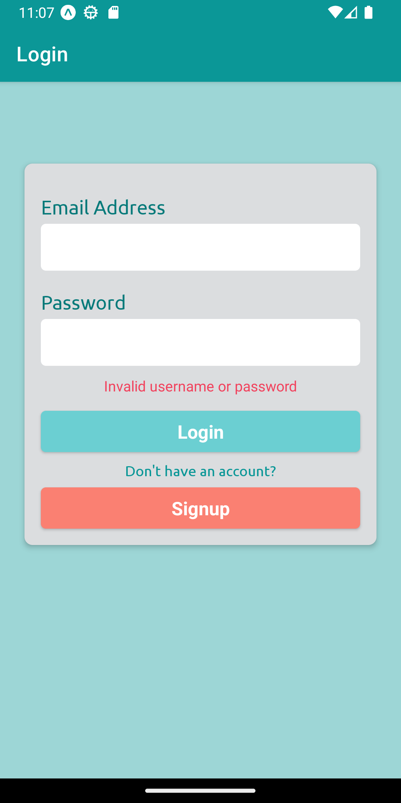

# Smart Garage

</img>

## 📝 About

- This is a mobile application developed in React Native that makes use of IoT which allows users to remotely control their garage doors and also a delivery box when they are not home at the moment. With this app, users can open and close their garage doors, view the current status of the door (open or closed), and receive notifications when the door is opened or closed.
- It enables useres to monitor the usage of the delivery box and also receive notifications when it is left open for a certain period of time set by the user.

## 🛠️ Tehnologies Used

- React Native with Typescript
- ThingSpeak IoT Cloud Platform
- Firebase 
  - Authentication
  - Firestore
- Expo Go
- Android Studio Emulator
- Figma
- Postman

## ⚙️ Hardware

- NodeMCU ESP8266 X 2
- SG90 Servo Motor X 2
- LED
- Breadboard

## 💡Functionality

- 👩‍💻Users can
  - Sign up / Login
  - View the current status of the garage door and the delivery box
  - open and close the garage door and the delivery box
  - Receive notifications when the garage door or the delivery box is left open for a certain period of time set by the user
  - Enable Auto-Close Mode for the garage door and the delivery box
- 👤 Admin can
  - Allow/Deny access to the app for users
  - Access all the functionalities of the app
    <br>

## 📐 Architecture

<br>
</img>

<br>

## 🧰 Circuit Diagram

<br>

</img>

<br>

## 📸 Screenshots

<br>

<table>
  <tr>
    <td></td>
    <td></td>
    <td></td>
  </tr>
  <tr>
    <td></td>
    <td></td>
    <td></td>
  </tr>
  <tr>
    <td></td>
    <td></td>
    <td></td>
  </tr>
  <tr>
    <td></td>
  </tr>
</table>

## 🛠️ Installation and setup instructions

<br>

1. Clone down this repo. <br><br>
   ```sh
   git clone https://github.com/bedre7/smart-garage.git
   ```
2. Install npm dependencies
   <br><br>
   ```sh
   npm install
   ```
3. Run expo app<br><br>
   ```sh
   expo start
   ```
